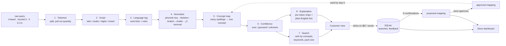

# What You Meant

**Grocery search for how the UAE actually types, and it shows you how it read you.**

## The problem

Grocery apps in the UAE are built on clean English and Arabic product names. Real customers
type `dahi 1kg`, `3eish`, `chawal basmati 5 kilo`, `leban` or `الحليب ٢ لتر`: Urdu written in Latin
letters, Arabic written with digits for letters, words spelled by ear. Search either returns nothing,
or it silently "corrects" the query into something else. We tested a typical fuzzy search on `3eish`
(rice in Gulf Arabic, bread in Egyptian) and it returned **Farm Fresh Brown Eggs**. The customer
decides the store doesn't stock it and leaves. The store never finds out it lost the sale.
**The failure is silent on both sides.**

## What we built

1. **A search pipeline** that understands code-switched, spelled-by-ear and wrong-script queries.
   It has 8 small deterministic stages, with no LLM and no API key.
2. **A customer view that never corrects silently, in plain shop language.** It says
   "Showing results for yogurt" and only raises a note when it's unsure: "We think *leban*
   means laban. Not right?", "*3eish* can mean rice or bread. Which one?", or "We don't know
   *nihari* yet, so we didn't replace it with a guess." One click on **How we read your search**
   opens the full per-word view: 🟢 sure / 🟡 guessed (with a similarity score) / 🔴 unknown, and
   *original → normalized → meaning → language → which rule decided it*.
   A toggle shows what a normal store search returns for the same query, side by side.
3. **A store dashboard** (manager sign-in required) with: headline numbers, the **suggestions to
   review** (Approve / Dismiss), a **search quality** chart (typical search vs ours), the **top
   missed searches** (words that ended in zero results), a **recent activity** log, and a **word
   insights** table. A learned mapping is only *proposed*; search doesn't use it until the manager
   clicks **Approve**, and every change is logged with who made it.

### Two sides, one app

The start page asks who you are.

| | Customer | Store manager |
|---|---|---|
| Gets to | Search (`/shop`), no sign-in | Dashboard (`/store`) after the manager password, **and** a *Customer view* switch to see what shoppers see |
| Can reach the other side? | Only the manager **sign-in screen** (top-right button). Dashboard data is refused by the server (401) without a manager session | Yes, via the Dashboard / Customer view switch |
| Leaving | n/a | **Sign out** returns to the start page |

The two sides share **data**, not navigation: customer searches and clicks feed the dashboard, and
the manager's approvals change what customers see.

### How it addresses both themes

| Theme | How |
|---|---|
| **Code-switching and spelling by ear** | Per-token script detection and language tagging (English / Roman Urdu-Hindi / Arabizi / Arabic). Spelling-by-ear normalization: phonetic keys, consonant skeletons, Arabizi→Arabic transliteration with regional digit variants, Arabic orthography folding. Phrases across languages (`zaitoon ka tel` = olive oil). |
| **Interfaces that change silently** | Nothing is replaced without being shown: every guess is labeled 🟡 and every unknown word stays 🔴. Ambiguous words (`3eish`, `حمص`) show *both* meanings instead of picking one. The system learns from clicks, but a learned mapping cannot change search until the store approves it, and every proposal, approval and removal is logged. |

## Architecture



**How a word is matched.** The pipeline tries these steps in order and stops at the first one that
matches; the step that matched is shown to the customer as the "why":

| # | Step | Example | Confidence |
|---|---|---|---|
| 0 | Store-approved learned mapping | `qeema` → meat | 🟢 |
| 1 | Exact word-list hit (after lossless clean-up: lowercase, أ→ا, remove ال) | `dahi`, `الحليب` | 🟢 (🟡 if the word has two meanings) |
| 2 | Word from product names (brands, "basmati") | `almarai` | 🟢 |
| 3 | Urdu/Hindi `-wala` ending removed | `doodhwala` → doodh | 🟡 |
| 4 | Phonetic key (long vowels, doubled letters, Arabizi digits folded) | `dahee`, `chawwal`, `7alib` | 🟡 |
| 5 | Consonant skeleton (vowels ignored) | `piyaz` → pyz | 🟡 |
| 6 | Arabizi → Arabic script, then Arabic lookup | `leban` → لبن, `ba9al` → بصل | 🟡 |
| 7 | English plural | `potatos` | 🟡 |
| 8 | Fuzzy match (rapidfuzz ≥ 80%) | `tumeric` | 🟡 |
| 9 | Nothing matched: kept as typed | `nihari` | 🔴 |

Steps 4–6 skip any pattern that two different meanings share (e.g. skeleton `lbn` = *laban* and
*labna*), so an ambiguous shortcut never produces a confident-looking guess.

## Results

150 labelled queries (`data/eval/queries.csv`) run through two baselines and our pipeline over the
same 154-product catalog. The tables below are written into this file by `python eval/run_eval.py`.

<!-- EVAL:START -->
#### Overall

| System | Hit@3 ↑ | Zero-result rate ↓ | Silent wrong-result rate ↓ |
|---|---|---|---|
| Baseline 1: keyword | 17.1% | 82.1% | 2.0% |
| Baseline 2: fuzzy (rapidfuzz) | 44.3% | 17.1% | 44.0% |
| Ours: What You Meant | 100.0% | 0.0% | 1.3% |

- **Hit@3**: a correct product is in the top 3 (matchable queries).
- **Zero-result**: nothing returned although the store stocks it (matchable queries). This is the lost sale.
- **Silent wrong**: the top result is the wrong product and the system gave no sign of doubt (all queries). Our results are *not* counted as silent when a token was shown as 🟡 guessed or 🔴 unknown.

#### By query type

| Type | n | Hit@3 keyword / fuzzy / **ours** | Zero-result keyword / fuzzy / **ours** | Silent wrong keyword / fuzzy / **ours** |
|---|---|---|---|---|
| English | 28 | 36.0% / 88.0% / **100.0%** | 64.0% / 4.0% / **0.0%** | 0.0% / 21.4% / **0.0%** |
| Roman Urdu/Hindi | 45 | 2.4% / 14.3% / **100.0%** | 97.6% / 28.6% / **0.0%** | 0.0% / 57.8% / **2.2%** |
| Arabizi | 35 | 0.0% / 9.1% / **100.0%** | 97.0% / 21.2% / **0.0%** | 2.9% / 68.6% / **2.9%** |
| Arabic script | 23 | 52.4% / 85.7% / **100.0%** | 47.6% / 0.0% / **0.0%** | 8.7% / 26.1% / **0.0%** |
| Mixed / code-switched | 19 | 15.8% / 68.4% / **100.0%** | 84.2% / 21.1% / **0.0%** | 0.0% / 21.1% / **0.0%** |
<!-- EVAL:END -->

Full report with the seen/unseen split, not-stocked queries, every failure and every change made
after the first run: [eval/results.md](eval/results.md).

**How to read these honestly**

- The keyword baseline's low silent-wrong rate is not a strength: it almost never returns anything
  (82% zero results), so it rarely gets the chance to be wrong. The fair comparison is the fuzzy baseline.
- **We wrote both the eval queries and the lexicon.** The queries were written before the pipeline
  was run on them, most use spellings deliberately left *out* of the lexicon, and every
  post-run change is logged in the report. It is still not an independent test.
  <!-- TODO(team): add held-out queries written by people who haven't seen the lexicon, and report those numbers here. -->
- The known failures (`doodh patti` → milk ranked above tea; `3aseer burtuqal` → oranges above
  orange juice) show that compound "X tea" and "X juice" queries aren't understood yet.

**Reproduce:** `python eval/run_eval.py`

## Run it

Needs Python 3.11+ and Node 18+. Everything runs **offline** after setup, with no API keys.

```sh
pip install -r backend/requirements-dev.txt          # 1. Python deps
cd frontend && npm install && npm run build && cd ..  # 2. build the web app
python eval/run_eval.py                                # 3. evaluation (writes eval/results.*)
python -m uvicorn app.main:app --app-dir backend --port 8000   # 4. open http://localhost:8000
```

Or use the scripts: `scripts/setup.sh` then `scripts/start.sh` (Windows: `scripts\setup.ps1`, `scripts\start.ps1`).

- Start page: <http://localhost:8000/> (choose customer or store manager) · Customer search: <http://localhost:8000/shop> · Store dashboard: <http://localhost:8000/store> (password)
- On first start the database is seeded with two weeks of realistic search history.
  Reset it before a demo: `python backend/app/seed.py --reset` (or `scripts/reset-demo`).
- Tests: `python -m pytest`
- Try the pipeline in the terminal: `python backend/scripts/demo_queries.py "dahi 1kg" 3eish`
- Frontend dev mode with hot reload: run the uvicorn command above, then `cd frontend && npm run dev`
  (proxies API calls to :8000).

**Store manager password:** `store123` by default. Change it with `SAIDIT_MANAGER_PASSWORD`.
Customers never sign in.

Settings (environment variables): `SAIDIT_MANAGER_PASSWORD` (dashboard password), `SAIDIT_CONFIRMATIONS` (clicks needed to propose a mapping, default 3),
`SAIDIT_DB` (database path), `SAIDIT_NO_SEED=1` (start with an empty database).

### Try it in two minutes

1. Open the start page, choose **I'm a customer**, and search `3eish`. It can mean rice *or* bread,
   so you get both and a "Which one?" choice. Tick **Compare with a typical store search**: the
   typical search shows eggs.
2. Search `leban` (a guess, shown as one), then `nihari` (not stocked: we say so instead of guessing).
3. Click **Store manager sign-in** (top right), enter the password, and approve **3eish → rice**.
4. Switch to **Customer view** and search `3eish` again: it now reads as rice, "approved by the store",
   and the change is in **Recent activity** with an Undo.

Reset the demo data afterwards with `python backend/app/seed.py --reset`.

### Share a live demo link

The app is one server on port 8000, so a tunnel is enough. With [ngrok](https://ngrok.com):

```sh
# set your own manager password first: the default one is published in this README
$env:SAIDIT_MANAGER_PASSWORD = "choose-something"   # PowerShell  (bash: export SAIDIT_MANAGER_PASSWORD=...)
python -m uvicorn app.main:app --app-dir backend --port 8000
ngrok http 8000                                       # in a second terminal; share the https URL it prints
```

The free ngrok plan shows visitors a one-time "You are about to visit" page; they click **Visit Site**.
The link stops working when ngrok or the app stops, and changes each time ngrok restarts.

### API

| Method | Path | Does |
|---|---|---|
| POST | `/search` `{query}` | `{tokens: [explanation…], quantity, summary, results, baseline_results}` |
| POST | `/feedback` `{query, product_id, type}` | `type`: `click` or `not_what_i_meant`. Clicks on 🟡/🔴 words add confirmations |
| POST | `/auth/login` `{password}` · `/auth/logout` · GET `/auth/me` | store-manager sign-in (HttpOnly session cookie) |
| GET | `/store/words` 🔒 | unfamiliar words, lost-sale flags, all learned mappings |
| POST | `/store/mappings/{id}/approve` · `/remove` 🔒 | the only way a learned mapping changes search |
| GET | `/store/changelog` 🔒 | every proposal / approval / removal, newest first |
| GET | `/eval/summary` | the evaluation numbers |

🔒 = needs the store manager to be signed in; returns 401 otherwise.

## Repository map

```
backend/pipeline/    the 8 stages: tokenizer, script, language, normalize, lexicon (indexes),
                     concepts (mapping + confidence), search, explain; pipeline.py runs them
backend/baselines.py keyword and fuzzy baselines
backend/app/         FastAPI (main.py), SQLite logging + learning rules (store.py), seed history
backend/tests/       unit tests per stage + API tests
data/                catalog.json (154 products), concepts.json (71 concepts),
                     lexicons/ (English, Roman Urdu/Hindi, Arabizi, Arabic), eval/queries.csv
eval/run_eval.py     evaluation; writes eval/results.md, results.json and the table above
frontend/            React + Vite + Tailwind: start page (/), customer search (/shop), store dashboard (/store)
```

## Originality

> **TODO(team):** fill in from our own research. Placeholders only; nothing here has been checked yet.

| Product | What exists | What it does with `dahi` / `3eish` / `leban` | How ours differs |
|---|---|---|---|
| Noon | _TODO_ | _TODO_ | _TODO_ |
| Carrefour UAE | _TODO_ | _TODO_ | _TODO_ |
| Talabat Mart | _TODO_ | _TODO_ | _TODO_ |
| InstaShop | _TODO_ | _TODO_ | _TODO_ |

What we believe is new (to verify against the research above): per-token *visible* interpretation
with confidence levels instead of silent correction; ambiguity shown rather than resolved; and
learning that is gated by store approval with a public change log.

## Deliberately not building

- A real store: no cart, checkout, payments or user accounts (the only sign-in is one shared store-manager password protecting the dashboard)
- A chatbot or shopping assistant
- Recommendations or personalization
- General translation of arbitrary text
- Speech or voice input
- Languages beyond English, Roman Urdu/Hindi, Arabizi and Arabic script
- An LLM in the core pipeline (an optional, off-by-default fallback for 🔴 words is the only place one could go)

## Limitations

- **Small, hand-written lexicon.** 551 surface forms for 71 concepts, covering groceries only.
  Anything outside it is 🔴 until the store learns it.
- **Arabizi varies by region.** We try both common readings of `9` (ق / ص) and `8` (غ / ق), but
  other conventions (e.g. Moroccan) aren't covered, and transliteration is a candidate
  search, not real phonology.
- **Regional meanings are opinions.** `laban` is mapped to the Gulf drink, `بطاطا` to potato
  (sweet potato in Egypt), and `قهوة` to coffee in general. These are marked in the lexicon `note` fields.
- **Compound phrases.** "X juice" and "X tea" aren't understood as one thing unless the phrase is
  in the lexicon (see the failures above).
- **Urdu in Arabic script** (e.g. دودھ) is not handled; only Arabic is.
- **The evaluation is self-written** (see above), and the seeded dashboard history is synthetic.
- **Learning trusts clicks.** Three clicks from one person count the same as three people.
  A real deployment would count distinct shoppers.
- **Sign-in is demo-grade.** One shared manager password, sessions kept in memory (a server restart
  signs everyone out), no rate limiting, and plain HTTP on localhost. Fine for a demo, not for production.
- **Ranking weights are hand-set** (1.0 sure, 0.8 guessed, +0.3 for pack size…), not tuned.
